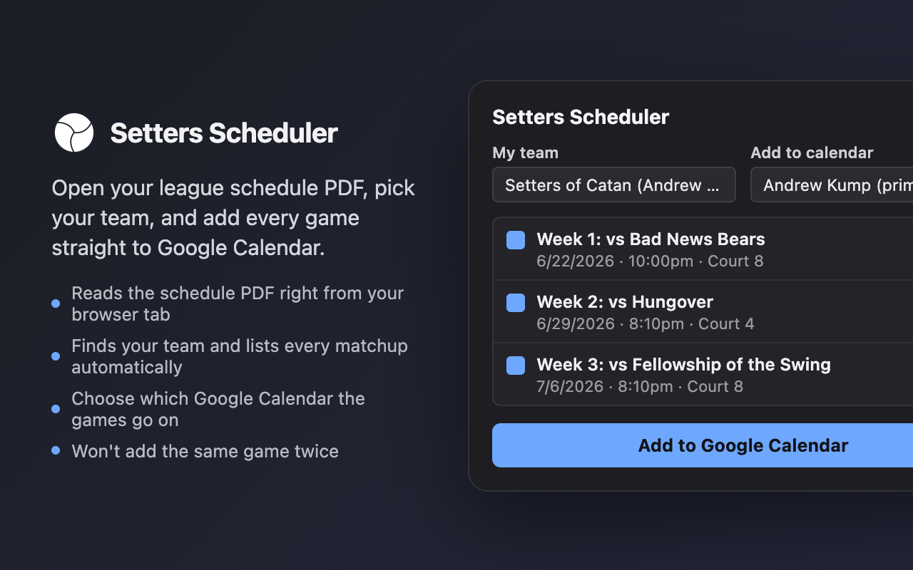

# Setters Scheduler



A Chrome extension that reads a league schedule PDF open in your browser tab,
finds your team, and adds its games to Google Calendar — with one click.

## Features

- Parses the schedule PDF directly from the browser tab (no upload, no
  external service)
- Auto-detects the team roster and every "Week / Court / Time" matchup
- Pick your team and which Google Calendar the games go on
- Skips games already on the calendar (matches by exact event title on the
  same day), so re-running it doesn't create duplicates
- Handles both weeknight (evening) and Sunday (late-morning/afternoon)
  league time slots

## Installing (unpacked, for personal use)

1. `chrome://extensions` → enable **Developer mode**.
2. **Load unpacked** → select this project folder.
3. Open your league's schedule PDF in a tab, click the extension icon, pick
   your team and calendar, and add the games.

## Google Calendar setup (one-time)

The extension needs its own Google OAuth client so it can create events on
your behalf. This can't be provisioned automatically — you'll need a (free)
Google Cloud project:

1. [Google Cloud Console](https://console.cloud.google.com/) → create/select
   a project.
2. **APIs & Services → Library** → enable the **Google Calendar API**.
3. **APIs & Services → OAuth consent screen**:
   - Add scopes: `.../auth/calendar.events` and
     `.../auth/calendar.calendarlist.readonly`.
   - Add your own Google account under **Test users** (the app stays in
     "Testing" mode for personal use — no verification needed).
4. **APIs & Services → Credentials → Create Credentials → OAuth client ID**:
   - Application type: **Web application**.
   - Authorized redirect URIs: `https://<extension-id>.chromiumapp.org/`,
     where `<extension-id>` is the ID shown for this extension on
     `chrome://extensions` (stable across reloads because `manifest.json`
     pins a `key`).
5. Copy the resulting client ID into `OAUTH_CLIENT_ID` in `background.js`.

If you later publish this to the Chrome Web Store, the Store assigns a
different extension ID — just add a second redirect URI
(`https://<store-id>.chromiumapp.org/`) to the same OAuth client; no new
client needed.

## Building for the Chrome Web Store

```cmd
npm run build
```

Produces `dist/setters-scheduler-v<version>.zip` containing only the runtime
files (manifest, scripts, icons, bundled pdf.js) — dev/test scaffolding and
the sample schedule PDF are left out. The packaged manifest also has the
local `key` field stripped, since the Web Store rejects uploads that include
one.

## Project layout

- `popup.html` / `popup.js` / `popup.css` — the extension's UI
- `parser.js` / `parser-core.js` — PDF text extraction (pdf.js) and the
  roster/schedule parsing logic (the latter has no browser dependencies, so
  it's unit-testable directly in Node)
- `background.js` — OAuth (`chrome.identity.launchWebAuthFlow`) and Google
  Calendar API calls
- `lib/` — bundled pdf.js runtime
- `store-assets/` — Chrome Web Store listing image source + render
